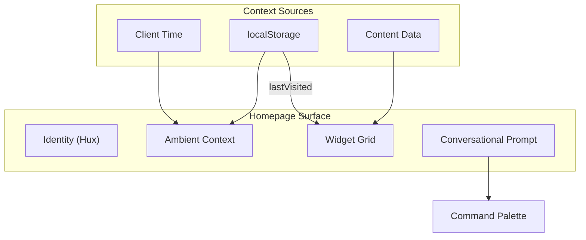

# AI-Native Homepage Redesign

## Overview

Transform the homepage from a traditional landing page into a "personal AI-native OS surface" with ambient awareness, widget-based content discovery, and a conversational command prompt.

## Architecture



## Key Components

### 1. Hux as OS Voice (Greeting Layer)

Hux speaks directly to the user, creating presence through address:

| Scenario | Hux Says |

|----------|----------|

| First visit, morning | "good morning. what can i show you?" |

| First visit, evening | "good evening. take your time." |

| Returning, same day | "welcome back." |

| Returning, read something | "welcome back. last time you were reading *[title]*." |

| Returning, long gap (>7 days) | "it's been a while. here's what's new." |

The voice is:

- Lowercase (calm, unhurried)
- Brief (not chatty)
- Warm but not effusive
- Acknowledges without demanding

Implementation in [`app/page.tsx`](app/page.tsx) using client-side hooks with localStorage for visit tracking.

### 2. Widget Grid (Bento-style)

Responsive CSS Grid layout with three widget types:

| Widget | Size | Content |

|--------|------|---------|

| Blog | Large (2x1) | 2-3 recent posts with dates, hover reveals description |

| Talks | Medium (1x1) | Most recent talk with event name |

| Career | Medium (1x1) | Current status with subtle ping animation |

Styling: Glassmorphic cards following System UI aesthetic from [`docs/design-philosophy.md`](docs/design-philosophy.md):

- `backdrop-blur-xl`, subtle borders, `bg-card/50`
- Hover: slight lift, border brightens

### 3. Conversational Prompt

Replace FAB with an inline prompt that morphs into the existing command palette:

- Default state: minimal Chatbot-like input with "what brings you here?" placeholder, replicating the current visuals
- On click/focus: expands and morphs into full command palette overlay
- Inherits all cmdk functionality (search, actions, shortcuts)

Changes to [`components/layout/command-palette.tsx`](components/layout/command-palette.tsx):

- Add `isInline` mode prop for homepage embedding
- Handle transition from inline to overlay mode

Changes to [`components/layout/fab.tsx`](components/layout/fab.tsx):

- Hide FAB on homepage (prompt serves as entry point)
- Keep FAB visible on all other pages
- Morph them in between page navigation

### 4. Context Provider Enhancement

Add to [`components/providers.tsx`](components/providers.tsx):

```typescript
interface VisitorContextType {
  lastVisited: { slug: string; title: string; type: 'blog' | 'talk' } | null;
  recordVisit: (item: VisitorContextType['lastVisited']) => void;
}
```

## Layout Structure

```
┌─────────────────────────────────────────────────────────────┐
│                                                             │
│                         λhux                                │  ← mono, small, muted
│                                                             │     (system identifier)
│                                                             │
│              good evening.                                  │  ← serif, large, hero
│              last time you were reading                     │     (Hux speaking to you)
│              On Design Systems.                             │  ← italic emphasis
│                                                             │
│                                                             │
│   ┌─────────────────────────────┐  ┌─────────────┐          │
│   │  On Design Systems          │  │  Currently  │          │  ← Widget Grid
│   │  The Future of Cross...     │  │  @ ByteD... │          │
│   │  On Developer Experience    │  ├─────────────┤          │
│   │                       Blog →│  │  Latest     │          │
│   └─────────────────────────────┘  │  Talk       │          │
│                                    └─────────────┘          │
│                                                             │
│              ┌───────────────────────────────┐              │
│              │ what brings you here? _    ⌘K │              │  ← conversational
│              └───────────────────────────────┘              │     prompt (input)
│                                                             │
│                                                             │
└─────────────────────────────────────────────────────────────┘
```

### Visual Hierarchy

1. **System identifier** (`λhux`): Mono, small, muted—like a terminal prompt or OS watermark
2. **Message to user**: Serif, large, warm—the voice of Hux addressing the visitor directly
3. **Widget grid**: Glassmorphic cards with content discovery at a glance
4. **Conversational prompt**: The input itself contains the invitation ("what brings you here?")

## Files to Modify

| File | Changes |

|------|---------|

| [`app/page.tsx`](app/page.tsx) | Complete rewrite with new layout |

| [`components/layout/command-palette.tsx`](components/layout/command-palette.tsx) | Add inline mode support |

| [`components/layout/fab.tsx`](components/layout/fab.tsx) | Hide on homepage |

| [`components/providers.tsx`](components/providers.tsx) | Add VisitorContext |

| [`lib/i18n.ts`](lib/i18n.ts) | Add new translation keys |

| [`app/globals.css`](app/globals.css) | Widget and grid styles |

## New Components

| Component | Location | Purpose |

|-----------|----------|---------|

| `AmbientGreeting` | `app/page.tsx` (inline) | Time/context display |

| `WidgetGrid` | `app/page.tsx` (inline) | Bento grid container |

| `BlogWidget` | `app/page.tsx` (inline) | Recent posts widget |

| `TalkWidget` | `app/page.tsx` (inline) | Recent talk widget |

| `StatusWidget` | `app/page.tsx` (inline) | Career status widget |

| `ConversationalPrompt` | `app/page.tsx` (inline) | Inline cmdk trigger |