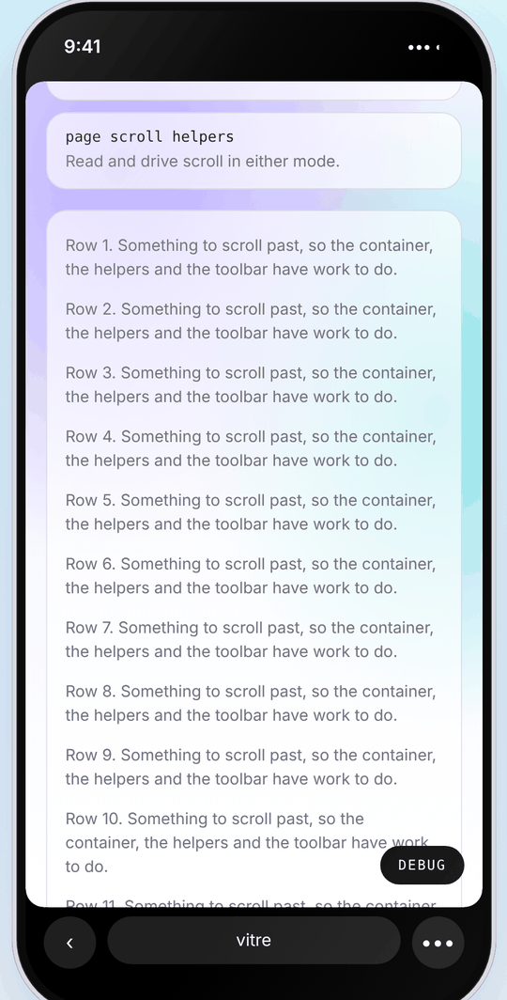
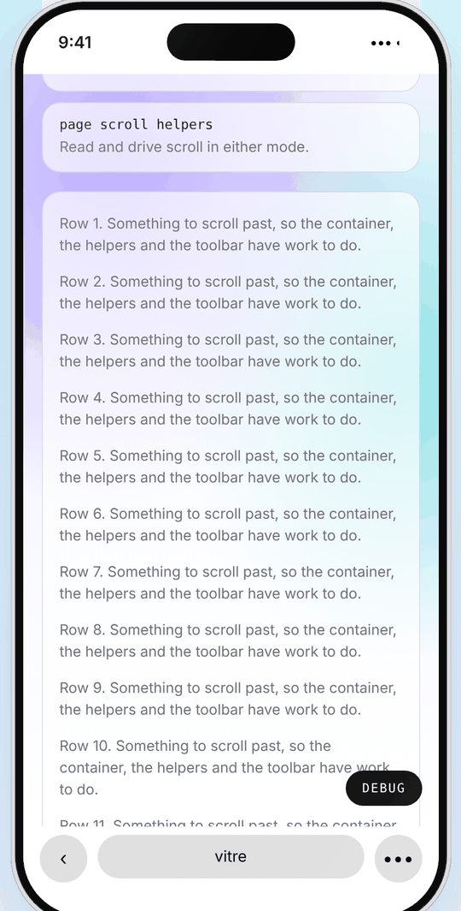
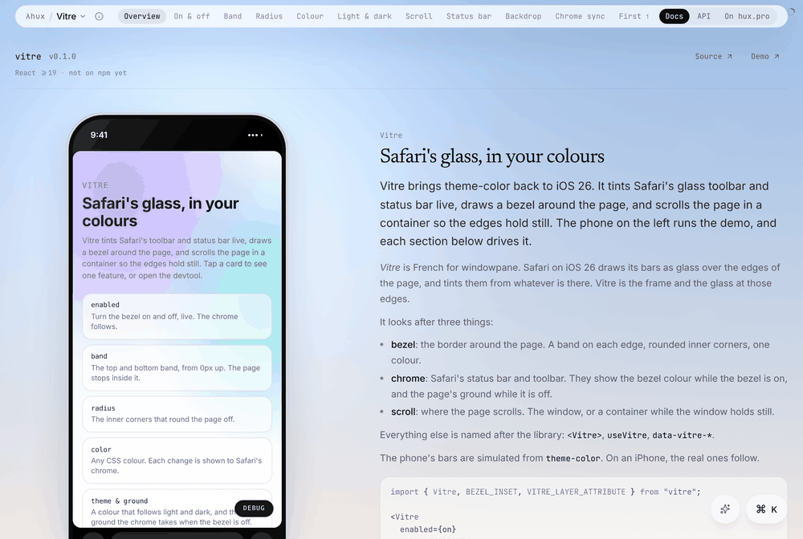

<!--
  Images use paths relative to this file: the package is private (not on npm),
  so this README is read on GitHub, where they resolve. If it is ever
  published, switch them to https://hux.pro/img/docs/vitre/... (npm renders
  only absolute image URLs).
-->

# Vitre

Safari `theme-color` for iOS 26, and safe page edges. Vitre draws a bezel around
the page, tints Safari's glass toolbar and status bar live, and scrolls the page
in a container so the edges hold still. For React.

*Vitre* is French for windowpane. Safari on iOS 26 draws its bars as glass over
the edges of the page and tints them from whatever is there. Vitre is the frame
and the glass at those edges.

The documentation, with a simulated iPhone running the demo beside it, is
[hux.pro/lab/vitre](https://hux.pro/lab/vitre); every export is on
[hux.pro/lab/vitre/api](https://hux.pro/lab/vitre/api). The public API is
[`vitre.d.ts`](./vitre.d.ts). `src/contract.ts` fails the type check if the
implementation drifts from it. This README is the part the lab leaves out: what
iOS Safari was measured doing, how the package works around it, and its limits.

## What it looks like

<p>
  
  
</p>

The demo in `/lab/vitre`'s phone, scrolled to the middle, with the bezel on
(left) and off (right). On, the bars take the bezel colour (black) and the page
is rounded off inside it; off, they take the page's ground. The bars here are
the lab's simulation, drawn from `theme-color`; on an iPhone, Safari's own
follow the same way.

## Words

Vitre looks after three things:

| Word | Means | In the API |
|---|---|---|
| **bezel** | The border around the page: a band on each edge, rounded inner corners, one colour. | `BEZEL_*`, `clampBezel*`, `data-bezel`, `--bezel-color`, `--bezel-band` |
| **chrome** | Safari's status bar and toolbar. They show the bezel colour while the bezel is on, and the page's ground while it is off. | `syncChrome`, `CHROME_*`, `chromeMorph` |
| **scroll** | Where the page scrolls: `window`, or `container` with the window held still. | `scroll`, the page scroll API, `PAGE_SCROLL_TIMELINE` |

Everything else is named after the library: `<Vitre>`, `useVitre`,
`vitreBootScript`, `VITRE_LAYER_ATTRIBUTE`, `data-vitre-*`, `#vitre-scroll`.

## Using it

```tsx
import { Vitre, BEZEL_INSET, VITRE_LAYER_ATTRIBUTE, vitreBootScript } from "vitre";

// <head>: paint the first frame right, before React.
<script dangerouslySetInnerHTML={{ __html: vitreBootScript(resolverSource) }} />

// Around the page.
<Vitre
  enabled={on}          // null until the client knows; holds what the boot script applied
  color="#000000"
  band={0}
  radius={16}
  scroll={on && isIOS ? "container" : "window"}
  ground={theme === "dark" ? "#1a1a1a" : "#ffffff"}
  backdrop={<div {...{ [VITRE_LAYER_ATTRIBUTE]: "" }} style={{ position: "fixed", ...BEZEL_INSET }} />}
>
  {page}
</Vitre>
```

Each prop, with the phone running it, is a section of
[the lab's guide](https://hux.pro/lab/vitre); the boot resolver is
[The first frame](https://hux.pro/lab/vitre#boot).

## Scroll

`scroll` picks the page's scroller: the window, or a container inside the bezel
with `<html>` and `<body>` held still. `<Vitre>` writes the choice to `<html>`
(`data-vitre-scroll`), and everything else reads it there. It is independent of
`enabled`, `color` and `band`. Use container scroll while the bezel is on.


The same page in both modes. In container scroll every full-screen layer inside
`<body>` turns absolute (dashed), so nothing the page draws tints the chrome, and
`#vitre-scroll` takes over the scroll and the `--page-scroll` timeline. Only
`syncChrome`'s bands, children of `<html>`, stay fixed where Safari samples them.

| | `window` | `container` |
|---|---|---|
| Scroller | The document | A container inside the bezel |
| Safari's toolbar | Collapses and expands with scroll | Stays expanded |
| `getScrollContainer()` | `null` | The container |
| `window.scrollY`, `scrollTo`, `scroll` event | The page | Not the page's scroll |
| `animation-timeline: scroll(root)` | The page | Silent. Use `--page-scroll` |
| Tap on the status bar | Scrolls to the top | Scrolls to the top on iOS (see [The status-bar tap](#the-status-bar-tap)) |
| Full-screen fixed layers (`body > .fixed`, `body >` an inline `position: fixed`, `VITRE_LAYER_ATTRIBUTE`) | fixed | absolute |
| `position: sticky`, IntersectionObserver, `scrollIntoView`, anchors | Work | Work |

Switching keeps the scroll position and notifies page scroll listeners.

Code that reads or drives page scroll goes through the package:
`getScrollContainer()` for anything that takes a scroll element (bound again
when `useVitre().scroll` changes), and `pageScrollTop`, `pageScrollHeight`,
`pageViewportHeight`, `pageOffsetOf`, `scrollPageTo`, `onPageScroll`,
`usePageScroll` and `emitPageScroll`, which read the mode on every call and act
on the window without `<Vitre>`. Scroll-driven CSS binds to
`animation-timeline: --page-scroll` (`PAGE_SCROLL_TIMELINE`) or
`scroll(nearest)`. Which one a page needs, with examples, is
[Page scroll, in either mode](https://hux.pro/lab/vitre#pageScroll).

## The chrome: does anything need a reload?

No. Everything is live, as long as each change is shown to the chrome.

"One colour per page load" was a workaround for iOS 26 Safari not re-reading the
root background (see [What iOS Safari does](#what-ios-safari-does)), not a
platform limit. `syncChrome(color, { band, radius })` shows Safari the new
colour as a morph of the bezel. A fixed bezel in the new colour grows from the
current band to `CHROME_MORPH_PX` (8px; a thicker band stays put) in 160ms,
holds 440ms, and shrinks back in 280ms, its corners riding the inner edge. It
also sets `theme-color`, for iOS 18. `<Vitre>` calls it whenever the chrome
colour should change.

Two details make it work, both measured:

- **Each band is its own fixed element.** Safari samples what is composited
  under a fixed element's box, so a transparent full-screen container with
  coloured children does not change the chrome.
- **The bands are children of `<html>`.** In container scroll, fixed children
  of `<body>` become absolute, and Safari does not sample absolute content.

The morph is for a chrome that samples the page, which means iOS Safari. Pass
`chromeMorph={false}` (or `syncChrome(color, { morph: false })`) everywhere
else. `theme-color` is still set, which Android Chrome and macOS Safari follow,
and nothing is drawn. On a desktop window the morph would only be 880ms of 8px
bands on every theme change.

In a recording of the bezel turning on over a light page, the chrome goes from
white to black within one 50ms frame of the band reaching the edge. The 8px band
holds for about 450ms, and the chrome stays black after it shrinks to 0px.

| Change, without a reload | Without `syncChrome` | With it |
|---|---|---|
| Bezel turned on | Chrome stays the ground colour | Bezel colour |
| Bezel turned off | Chrome stays the bezel colour | Ground colour |
| Tint changed, black to dark | Not tested | Chrome `(26, 26, 26)` |
| Theme flipped, bezel colour following the theme | Chrome stays white | `(26, 26, 26)`, then white again |
| Theme flipped, bezel off | Chrome stays white | Chrome `(26, 26, 26)`, then white again |
| Theme flipped, bezel on | Not tested | Chrome keeps the bezel colour |

## What is live, and how

Every prop of `<Vitre>` is live:

| Change | How |
|---|---|
| `enabled`, `color`, `band` | Written to `<html>` (`data-bezel`, `--bezel-color`, `--bezel-band`, background) in a layout effect. The chrome is resynced when the colour it should show changes (a band change alone does not resync). |
| `radius` | The corners re-render. |
| `scroll` | `data-vitre-scroll="container"` on `<html>`. The scroll position moves between the window and the container, and page scroll listeners fire. On iOS, a status-bar tap reaches the container while the page is away from the top. |
| `ground` | The chrome is resynced while the bezel is off. |
| Page hidden or shown | `visibilitychange`, `pagehide` and `pageshow` show the chrome its colour again. Leaving and returning (a Home Screen web app closed and reopened, Safari backgrounded) makes iOS sample the page background. |
| Something strips `<html>` | A mutation observer puts the state back before the next paint. |

## The status-bar tap

Tapping the status bar scrolls to the top, and iOS gives that gesture only to
the main `WKScrollView`. WebKit sets `scrollsToTop = NO` on every overflow
`UIScrollView` it creates, so the scroll container can never have it.

The window can. `<body>` is fixed at inset 0, so a few pixels of window scroll
move nothing on screen. While the page is away from the top, `<html>` gets
`data-vitre-status-tap`, a few pixels of scroll range, and a park inside it.
When Safari takes that back to 0, with no finger on the glass and no viewport
change, that was the tap. The container then eases to the top on the chrome
morph's curve, in 280 to 640ms by distance. Reduced motion jumps. A touch stops
it where it is.

It has to get four timings right:

- **One decision per frame.** Scroll events are asynchronous, and one frame can
  carry two: the container's and the window's. The handlers only schedule a
  reconcile in `requestAnimationFrame`, which runs after that frame's scroll
  events. If the handlers acted directly, the container's could re-park the
  window before the window's ran, and the tap would sometimes be swallowed,
  depending on which scroller moved first.
- **The tap usually lands mid-fling.** Momentum the compositor is still applying
  fights every `scrollTop` written under it. So the fling is ended first, with
  one frame of `overflow: hidden` that must span a whole frame or the compositor
  never sees it. If the container moves anyway, the return re-bases itself
  instead of yanking it back onto a stale curve.
- **The park is a request.** On iOS the main frame scrolls in the UI process, so
  `window.scrollY` still reports the old offset right after `window.scrollTo`.
  The park is confirmed later, and only a confirmed park can read as a tap or be
  taken back.
- **Arming unlocks the page.** Overlay libraries treat `overflow: hidden` on
  `<html>` as "already locked" (Base UI reads the computed `overflow-y` of the
  viewport scroller). While armed, `<html>` doesn't read that way. So arming
  stands down as soon as anything writes an inline overflow onto `<html>`, and
  re-arms when it clears. A park that doesn't stick is fine too: the next
  scroll, mutation or resize tries again, and every failed park ends in one of
  those.

It runs only on iOS. Elsewhere there is no gesture to catch, and `<html>` is
better left alone. A host can switch on container scroll anywhere (hux.pro's
devtool does), so the check is on the platform, not the mode.

## Limits

- Fixed overlays rendered inside the scroll container can reach the viewport
  edge while shown, and tint the chrome for that time.
- The morph is visible: an 8px band in the new colour for about 600ms.
- iOS 18's expanded bottom toolbar follows neither `theme-color` nor the root
  background.
- In container scroll the stylesheet makes `body > .fixed` (Tailwind's class)
  and direct children of `<body>` with an inline `position: fixed` absolute.
  Any other full-screen layer must carry `VITRE_LAYER_ATTRIBUTE`, or it stays
  fixed and tints the chrome.
- In container scroll the page looks scroll-locked (`<html>` is
  `overflow: hidden`). A well-behaved overlay library sees that and keeps out
  of the way, as Base UI's dialogs do, so the host keeps its layout. A library
  that always locks by writing `position: relative` and a height onto `<body>`
  will collapse this layout, so check before adopting one. While a status-bar
  tap is armed, `<html>` doesn't read as locked and such a library takes over.
  On iOS, Base UI's lock is only an inline `overflow: hidden` on `<html>`, and
  arming steps aside for as long as it holds.
- The status-bar tap and a scroll lock can't be held together, so the gesture
  does nothing while a sheet is open. It comes back when the sheet closes.
- In container scroll, any other code calling `window.scrollTo(0)` would read
  as a tap. Nothing on hux.pro does. `scrollPageTo` moves the container.

## Demo and documentation



`/lab/vitre` on a desk: the drawn phone runs the demo, and the section in the
middle of the screen drives it.

- **The demo** is `packages/vitre/site`, built with Vite and importing only
  `vitre`. A small site inside `<Vitre>`, with cards that each run one feature,
  and a devtool that edits every prop and shows what Vitre resolved, wrote to
  `<html>` and set as `theme-color`. Settings are saved and the boot script
  paints the next load from them, so Safari's real chrome can be tested.
- **Where it is served.** hux.pro builds it into `public/vitre` and serves it at
  `/vitre`. A phone gets it full screen there; any other user agent is
  redirected to `/lab/vitre` (`next.config.ts`), where it runs framed
  (`/vitre/index.html?frame`) in the drawn phone, in the site's light or dark,
  and each section drives it over `postMessage`. `/vitre/index.html` itself is
  never redirected.
- **In `pnpm dev`** the demo is built before Next starts whenever it is
  missing or older than its sources (`scripts/vitre-demo.mjs`); it has no hot
  reload inside the site, so rebuild it with `pnpm vitre:site:build`.
- **The documentation's content** stays here, in `site/src/docs`: the sections
  (`sections.tsx`) and the API reference (`api.ts`), bilingual. Every export and
  prop is documented, and the reference is type-checked against `vitre.d.ts`,
  so `pnpm vitre:typecheck` fails for an undocumented one. hux.pro's lab
  renders it (`app/lab/vitre`, in the lab's library template): the guide with
  its section tabs and simulator, the API page built from `api.ts`, and how
  hux.pro itself uses the package (`/lab/vitre/site`). The pages are the
  lab's, the words are the package's.

To work on the demo alone:

```bash
pnpm vitre:site
```

Then open `http://localhost:5173/vitre/` on a phone on the same network or in
the iOS simulator. (`vite dev` shows the demo on any screen; for the
documentation run hux.pro.)

## Testing

```bash
pnpm vitre:typecheck
```

It checks the implementation against `vitre.d.ts` (`src/contract.ts`), and the
lab's API reference (`site/src/docs/api.ts`) against `vitre.d.ts`, so a new
export or prop fails until it is documented. It also type-checks the demo.

## What iOS Safari does

The measurements every rule above rests on. Measured in the iOS 26.5 simulator
by reading screenshot pixels, and checked on a phone. iOS 18.5 is noted where it
differs.

| Behaviour | iOS 26.5 | iOS 18.5 |
|---|---|---|
| Chrome colour at load | The root background, or `position: fixed` content spanning the viewport edge. It copies the composited pixels, even when the content is transparent. | `theme-color` |
| Root background changed later | Not re-read. The chrome keeps the old colour. | Not re-read |
| `theme-color` changed later | Ignored | Followed |
| Fixed content at the edge, added later | Followed live from 6 CSS px thick (5 does not register; `CHROME_SAMPLE_PX`). The colour stays after the content is removed. | Not measured |
| Toolbar collapse | The user scrolling the document down collapses it, and scrolling up expands it. A script's scroll leaves it alone, except that reaching the top expands it. Each collapse re-samples the chrome. | Same for the user's scroll. A script's scroll not measured. |
| Safe-area insets in portrait | All 0 | All 0 |
| React 19 failed hydration (error #418) | Strips every attribute off `<html>` | Same |

### Window scroll on iOS Safari

Why container scroll is the mode to use with the bezel. Measured in the iOS 26.5
simulator:

- **Edge leak.** Each time the toolbar collapses or expands, up to about 50px of
  the page shows below the bottom band for about 200ms. Safari is still drawing
  fixed elements at the old viewport size.
- **Live changes.** A toolbar collapse makes Safari sample the edge again. Now
  and then the chrome ends up on the wrong colour after a live change, until a
  reload.

---

For contributors: working on this package inside hux.pro has a checklist, the
skill [`.claude/skills/vitre`](../../.claude/skills/vitre/SKILL.md).
